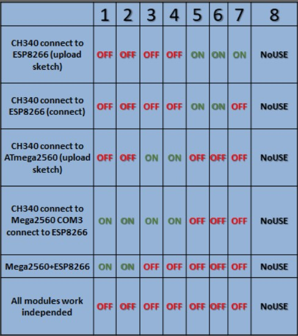

# How to Use Arduino Mega with Built-in ESP8266

Before using, ensure you understand the following information for a smooth workflow.

---

## Overview

The Arduino Mega 2560 with built-in ESP8266 is a versatile development board that combines the power of the Mega 2560 microcontroller and the Wi-Fi capabilities of the ESP8266 module. This board is ideal for IoT projects and allows seamless integration of Wi-Fi connectivity with Arduino-based applications.

---

## Key Features

### Arduino Mega 2560
- **Microcontroller**: ATmega2560  
- **Operating Voltage**: 5V  
- **Digital I/O Pins**: 54 (15 PWM outputs)  
- **Analog Input Pins**: 16  
- **Flash Memory**: 256 KB (8 KB used by bootloader)  
- **Clock Speed**: 16 MHz  
- **Built-in USB-to-Serial Converter**  

### ESP8266 Wi-Fi Module
- **Wi-Fi Standards**: 802.11 b/g/n  
- **Operating Voltage**: 3.3V  
- **Integrated TCP/IP Protocol Stack**: Supports multiple connections (up to 5 clients).  
- **Flash Memory**: 4 MB (varies by model).  
- **GPIO Pins**: 16 (varies by model).  
- **Baud Rate**: Configurable (default is 115200).  
- **Modes**: Station, Soft Access Point (AP), and Station + AP.  
- **Low Power Consumption**: Ideal for battery-powered IoT devices.  
- **Built-in Antenna**: Provides reliable Wi-Fi connectivity.  
- **Programmable**: Can be programmed using AT commands or custom firmware (e.g., NodeMCU).  

---

## Usage

### 1. Switch Modes
The board typically has a DIP switch to toggle between programming the Mega 2560 and the ESP8266. Ensure the correct mode is selected before uploading code.

### 2. Programming the ATmega2560
- Use the Arduino IDE to upload sketches to the ATmega2560.
- Set the DIP switch to connect the CH340 to the ATmega2560.
- Select the correct COM port and board type (`Arduino Mega 2560`) in the Arduino IDE.

### 3. Programming the ESP8266
- Use the Arduino IDE or a dedicated ESP8266 flashing tool to upload firmware or sketches to the ESP8266.
- Set the DIP switch to connect the CH340 to the ESP8266.
- Install the ESP8266 board package in the Arduino IDE if programming directly.

### 4. Using AT Commands
- The ESP8266 can be controlled using AT commands when in default firmware mode.
- Example AT commands:
  - `AT`: Check if the module is responding.
  - `AT+GMR`: Get the firmware version.
  - `AT+CWMODE=1`: Set the module to station mode.
  - `AT+CWJAP="SSID","PASSWORD"`: Connect to a Wi-Fi network.

### 5. Serial Communication Between ATmega2560 and ESP8266
- Use the `Serial` or `SoftwareSerial` library to establish communication between the ATmega2560 and ESP8266.
- Example code snippet:
  ```cpp
  #include <SoftwareSerial.h>
  SoftwareSerial espSerial(10, 11); // RX, TX

  void setup() {
    Serial.begin(9600); // Communication with PC
    espSerial.begin(115200); // Communication with ESP8266
    Serial.println("Setup complete");
  }

  void loop() {
    if (espSerial.available()) {
      Serial.write(espSerial.read());
    }
    if (Serial.available()) {
      espSerial.write(Serial.read());
    }
  }
  ```

---

## Serial Communication for Connecting Both ESP8266 and Arduino Mega 2560

When connecting both the ESP8266 and Arduino Mega 2560, serial communication is used to exchange data between the two modules. This is essential for IoT applications where the Mega 2560 handles logic and the ESP8266 provides Wi-Fi connectivity.

### Steps to Connect

1. **Configure the DIP Switch**:
   - Set the DIP switch to enable communication between the Mega 2560 and ESP8266.
   - Refer to the DIP switch configuration table for the correct settings.

2. **Establish Serial Communication**:
   - Use the `Serial` or `SoftwareSerial` library to send and receive data between the two modules.

3. **Example Code**:
   The following example demonstrates how to send a command from the Mega 2560 to the ESP8266 and receive a response:

   ```cpp
   #include <SoftwareSerial.h>

   // Define RX and TX pins for ESP8266 communication
   SoftwareSerial espSerial(10, 11); // RX, TX

   void setup() {
     // Initialize serial communication with PC and ESP8266
     Serial.begin(9600); // Communication with PC
     espSerial.begin(115200); // Communication with ESP8266

     // Print setup message
     Serial.println("Setup complete. Type commands to send to ESP8266.");
   }

   void loop() {
     // Send data from PC to ESP8266
     if (Serial.available()) {
       String command = Serial.readStringUntil('\n');
       espSerial.println(command); // Send command to ESP8266
       Serial.println("Command sent to ESP8266: " + command);
     }

     // Receive data from ESP8266 and forward to PC
     if (espSerial.available()) {
       String response = espSerial.readStringUntil('\n');
       Serial.println("Response from ESP8266: " + response);
     }
   }
   ```

### Notes
- Ensure the baud rate for the ESP8266 matches its firmware configuration (commonly 115200).
- Use the Arduino IDE Serial Monitor to send commands and view responses.
- Common commands to test:
  - `AT`: Check if the ESP8266 is responding.
  - `AT+GMR`: Get the firmware version.
  - `AT+CWMODE=1`: Set the ESP8266 to station mode.
  - `AT+CWJAP="SSID","PASSWORD"`: Connect to a Wi-Fi network.

---

## Communication Between Arduino Mega 2560 and ESP8266

The Arduino Mega 2560 and ESP8266 communicate using serial communication. This allows the two modules to exchange data seamlessly for IoT applications.

### Serial Communication Setup

1. **Hardware Connection**:
   - The Arduino Mega 2560 and ESP8266 are connected internally via serial ports.
   - Use the DIP switch to configure the communication mode between the two modules.

2. **Software Configuration**:
   - Use the `Serial` or `SoftwareSerial` library in Arduino sketches to send and receive data between the Mega 2560 and ESP8266.

### Example Code for Serial Communication

The following example demonstrates how to establish serial communication between the Arduino Mega 2560 and ESP8266:

```cpp
#include <SoftwareSerial.h>

// Define RX and TX pins for ESP8266 communication
SoftwareSerial espSerial(10, 11); // RX, TX

void setup() {
  // Initialize serial communication with PC and ESP8266
  Serial.begin(9600); // Communication with PC
  espSerial.begin(115200); // Communication with ESP8266

  // Print setup message
  Serial.println("Serial communication setup complete.");
}

void loop() {
  // Forward data from ESP8266 to PC
  if (espSerial.available()) {
    Serial.write(espSerial.read());
  }

  // Forward data from PC to ESP8266
  if (Serial.available()) {
    espSerial.write(Serial.read());
  }
}
```

### Notes on Serial Communication
- Ensure the baud rate for the ESP8266 matches its firmware configuration (commonly 115200).
- Use appropriate voltage level shifters if connecting external components to avoid damaging the ESP8266.
- Debug communication using the Arduino IDE Serial Monitor.

---

## Applications

- IoT devices  
- Home automation  
- Wireless sensor networks  
- Remote data logging  

---

## Notes

- Ensure proper power supply to avoid damaging the ESP8266 module.  
- Familiarize yourself with AT commands if using the ESP8266 in default firmware mode.  

---

## Labeled Diagram of the Board

Below is a labeled diagram of the Arduino Mega 2560 with built-in ESP8266:


1. **Wi-Fi Module (ESP8266)**: Provides Wi-Fi connectivity for IoT applications.  
2. **ATmega2560 Microcontroller**: The main microcontroller for running Arduino sketches.  
3. **DIP Switch**: Used to toggle between programming the Mega 2560 and the ESP8266.  
4. **USB-to-Serial Converter**: Facilitates communication between the board and the computer.  
5. **Power Input (DC Jack)**: Accepts 7-16V DC input to power the board.  
6. **Digital I/O Pins**: 54 pins for digital input/output, including PWM outputs.  
7. **Analog Input Pins**: 16 pins for analog input.  
8. **Reset Button**: Resets the microcontroller.  
9. **Voltage Regulators**: Ensure stable power supply to the board components.  
10. **Communication Pins**: Dedicated pins for serial communication between the Mega 2560 and ESP8266.  

---

## DIP Switch Configuration

Refer to the DIP switch configuration table for proper settings based on the desired operation:



| Mode                                      | Switch 1 | Switch 2 | Switch 3 | Switch 4 | Switch 5 | Switch 6 | Switch 7 | Switch 8 |
|------------------------------------------|----------|----------|----------|----------|----------|----------|----------|----------|
| CH340 connect to ESP8266 (upload sketch) | OFF      | OFF      | OFF      | OFF      | ON       | ON       | ON       | OFF      |
| CH340 connect to ESP8266 (connect)       | OFF      | OFF      | OFF      | OFF      | OFF      | ON       | ON       | OFF      |
| CH340 connect to ATmega2560 (upload)     | OFF      | OFF      | OFF      | OFF      | OFF      | OFF      | OFF      | OFF      |
| CH340 connect to Mega2560 COM3, ESP8266  | ON       | ON       | ON       | ON       | OFF      | OFF      | OFF      | OFF      |
| Mega2560 + ESP8266                       | OFF      | OFF      | OFF      | OFF      | OFF      | OFF      | OFF      | OFF      |
| All modules work independently           | OFF      | OFF      | OFF      | OFF      | OFF      | OFF      | OFF      | OFF      |

---
````
